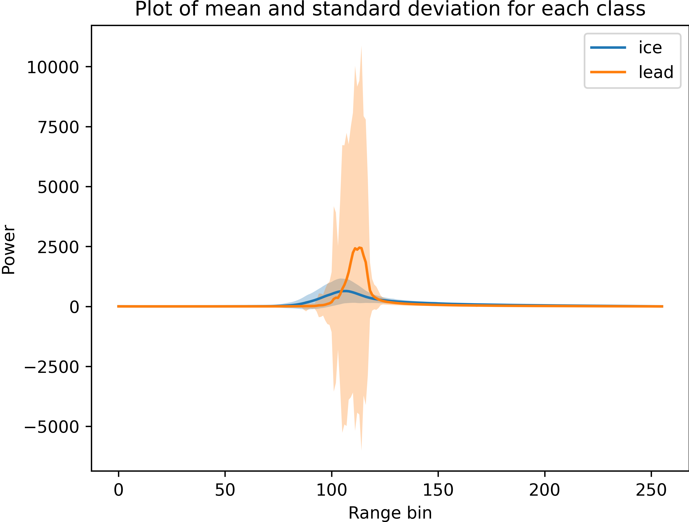
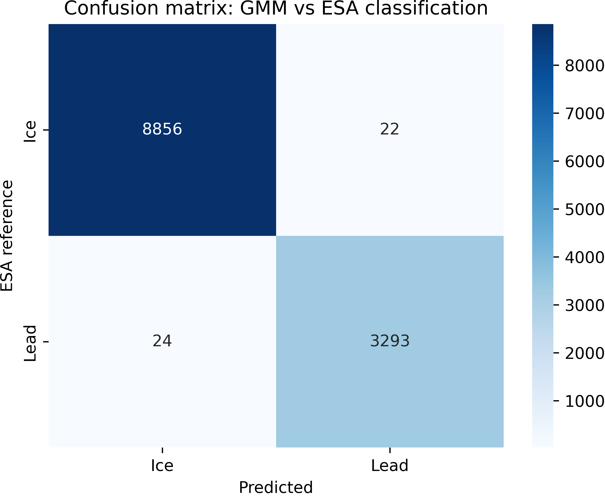

# GEOL0069 Week 4 Sea Ice & Leads Unsupervised Learning

This week project investigates the use of unsupervised leaning methods to classify radar altimetry echoes from Sentinel-3 altimetry satellite data into sea ice and leads. The notebook linked to this Github page is built on the provided notebook _Chapter1_Unsupervised_Learning_Methods_Michel.ipynb_, and focuses on using Gaussian Mixture Models (GMMs) to identify differences in echo shape. 

<!-- Satellite Altimetry Data -->
### Satellite Altimetry Data

The data used in this project comes from satellite radar altimetry. Radar altimeters operate by transmitting short radar pulses towards the Earth’s surface and recording the signal called echo that is reflected back to the sensor. The time delay and shape of the returned signal provide information about the surface properties.
<!-- What is an echo? -->
### What is an echo? 

An echo (also called a waveform) represents the returned radar power as a function of time after transmission. Different surface types interact differently with radar signals, resulting in characteristic echo shapes.
<!-- Echo Characteristics: Sea Ice vs Leads -->
### Echo Characteristics: Sea Ice vs Leads

The shape of an echo depends strongly on surface roughness and reflectivity:
- Leads (open water):
  - Smoother surface
  - Strong specular reflection
  - Echoes tend to be narrow and sharply peaked
- Sea ice:
  - Rougher and more heterogeneous surface
  - Scattering of the radar signal
  - Echoes are typically broader and noisier

Previous studies show clear differences in waveform shape between sea ice, leads, and open water. Figure 1 (Fig 1.) from the literature (2023) illustrate these characteristic differences and provide physical context for the clustering results.

[Zhong at al.2013](https://www.mdpi.com/2072-4292/15/2/516)

<!-- Unsupervised Learning : Gaussian Mixture Models (GMM) -->
### Unsupervised Learning : Gaussian Mixture Models (GMM)

In this study, unsupervised learning is used to classify echoes without providing surface labels to the algorithm. This allows the model to group echoes based solely on their statistical similarity. The ESA classification is used only after clustering for evaluation. 

Gaussian Mixture Models are probabilistic clustering methods that assume the data is generated from a mixture of multiple Gaussian distributions. Each Gaussian component is defined by its mean and variance.

In this project:
- A GMM with two components is used
- Each component is assumed to represent one surface type (sea ice or lead)
- The model assigns each echo to the most likely Gaussian component
GMMs are well suited for this task because they can model overlapping clusters and variations in echo shape.

<!-- Workflow -->
## Workflow

### Overview
This project follows a waveform-based unsupervised classification workflow to distinguish sea ice and leads using Sentinel-3 SAR altimetry data. Radar waveforms are first transformed into physically meaningful features that describe echo shape and surface scattering behaviour. These features are then clustered using a Gaussian Mixture Model (GMM) to identify natural groupings in the data. Finally, the clustering results are interpreted through waveform shape analysis and compared with the ESA surface-type classification for validation.

- [Envionrment Set Up](#envionment-set-up)
- [Loading Sentiminel-3 SAR Data](#loading-Sentiminel-3-SAR-Data)
- [Extracting Waveform Features from Radar Echoes](#Extracting-Waveform-Features-from-Radar-Echoes)
- [Data Cleaning and Filtering](#Data-Cleaning-and-Filtering)
- [Applying GMM Clustering](#Applying-GMM-Clustering)
- [Result Interpretation ](#Result-Interpretation )
- [Comparison with ESA Classification](#Comparison-with-ESA-Classification)
  
### Envionrment Set Up
Install software packages
```sh
! pip install rasterio
! pip install netCDF4
! pip install cartopy
  ```
Mount Google Drive on Google Colab
```sh
from google.colab import drive
drive.mount('/content/drive')
  ```
### Loading Sentiminel-3 SAR Data
The Sentinel-3 SAR data are loaded from the _enhanced_measurement.nc_ file, which contains waveform information required for echo analysis.
```sh
SAR_data = Dataset(path + SAR_file + '/enhanced_measurement.nc')
  ```
### Extracting Waveform Features from Radar Echoes
Each echo is described using scalar features:
- σ<sup>0</sup> (Backscatter Coefficient): radar backscatter strength
- PP (Peak Power): measures how sharp or peaked the echo is
- SSD(Surface Scattering Density): measures waveform shape variability

These features capture differences in surface roughness between echoes, 
```sh
PP=peakiness(waves)
SSD=calculate_SSD(RIP)
data = np.column_stack((sig_0_np,PP_np, SSD_np))
  ```
then standarised before clustering. 
```sh
scaler = StandardScaler()
data_normalized = scaler.fit_transform(data)
  ```
### Data Cleaning and Filtering
Only echoes classified by ESA as either sea ice or leads are retained. Other surface types are removed. 
```sh
nan_count = np.isnan(data_normalized).sum()
print(f"Number of NaN values in the array: {nan_count}")

data_cleaned = data_normalized[~np.isnan(data_normalized).any(axis=1)]

mask = ~np.isnan(data_normalized).any(axis=1)
waves_cleaned = np.array(waves)[mask]
flag_cleaned = np.array(flag)[mask]

data_cleaned = data_cleaned[(flag_cleaned==1)|(flag_cleaned==2)]
waves_cleaned = waves_cleaned[(flag_cleaned==1)|(flag_cleaned==2)]
flag_cleaned = flag_cleaned[(flag_cleaned==1)|(flag_cleaned==2)]
  ```

### Applying GMM Clustering
The model assigns each echo to the most likely Gaussian distribution without using surface labels. 
```sh
gmm = GaussianMixture(n_components=2, random_state=0)
gmm.fit(data_cleaned[(flag_cleaned==1)|(flag_cleaned==2)])
clusters_gmm = gmm.predict(data_cleaned[(flag_cleaned==1)|(flag_cleaned==2)])
  ```

Fig 2: _GMM clustering in feature space (σ<sup>0</sup> vs pp)._

This figure shows that echoes occupy two distinct regions σ<sup>0</sup> and PP suggiesting two dominant surface scattering regimes.

### Result Interpretation
For each GMM cluster, the mean waveform and its standard deviation are calculated to characterise typical echo shape and variability. 
```sh 
mean_ice = np.mean(waves_cleaned[clusters_gmm==0],axis=0)
std_ice = np.std(waves_cleaned[clusters_gmm==0], axis=0)

mean_lead = np.mean(waves_cleaned[clusters_gmm==1],axis=0)
std_lead = np.std(waves_cleaned[clusters_gmm==1], axis=0)
  ```

Fig 3: _Mean and Standard Deviation for Both Class_

This figure shows that one class has a narrow, shar-peaked waveform characteristic of leads, while other shows boarder, noisier echoes typical of sea ice. This confirms that GMM clusters correspond to physical suface types. 

### Comparison with ESA Classification
Even ESA labels were not used during clustering, but they still provide reference for evaluation. A confusion matrix compares GMM cluster with eSA classifications. 


Fig 4: _Confusion matrix: GMM vs ESA classification_

The matrix shows the unsupervised GMM results and the operational eSA classification are aligned which indicate that the clustering successfully captures real surface differences. 
<p align="right">(<a href="#readme-top">back to top</a>)</p> 


